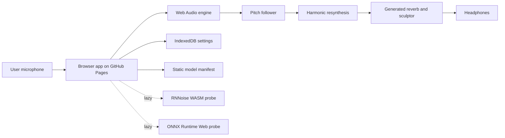

# WorldVoice

Live site:

https://baditaflorin.github.io/worldvoice/

WorldVoice is a browser-native live audio transformer that turns microphone input into instruments, choirs, and impossible spaces without uploading audio.


## What Works

- Real-time Web Audio pitch following and harmonic resynthesis.
- Violin, choir, sax, and dream-space performance presets.
- Generated impossible-space convolution reverb.
- Adaptive filtering, compression, delay, and animated live visualization.
- Lazy RNNoise WASM, ONNX Runtime Web, and Tone.js capability probes.
- Static model-pack manifest for future DDSP/RAVE/ONNX weights.
- IndexedDB settings persistence, PWA manifest, and service worker.

## Current Model Boundary

The v1 live chain is WebAudio-first and ships audited fallbacks. True DDSP/RAVE model weights are not bundled because available browser DDSP npm paths brought high and critical audit findings during implementation. The app includes adapter slots and static manifest metadata so audited ONNX packs can be added later without changing the GitHub Pages deployment mode.

Reference research and docs:

https://magenta.github.io/magenta-js/music/demos/ddsp_tone_transfer.html

https://github.com/magenta/ddsp

https://arxiv.org/abs/2111.05011

https://www.npmjs.com/package/%40shiguredo%2Frnnoise-wasm

https://onnxruntime.ai/docs/tutorials/web/

## Quickstart

```bash
git clone https://github.com/baditaflorin/worldvoice.git
cd worldvoice
npm install
make install-hooks
make dev
```

## Checks

```bash
make lint
make test
make smoke
make build
```

## Architecture



More architecture detail:

docs/architecture.md

ADR index:

docs/adr/

Deployment guide:

docs/deploy.md

Privacy:

docs/privacy.md

## Repository Shape

- `src/features/audio/`: audio engine, pitch tracking, presets, model manifest validation, storage.
- `src/components/`: reusable interface components.
- `public/models/manifest.json`: static model-pack contract.
- `docs/`: GitHub Pages output plus authored documentation.
- `.githooks/`: local hooks, installed by `make install-hooks`.

## Release

```bash
make lint
make test
make smoke
make build
make release VERSION=v0.1.0
git push origin main --tags
```
