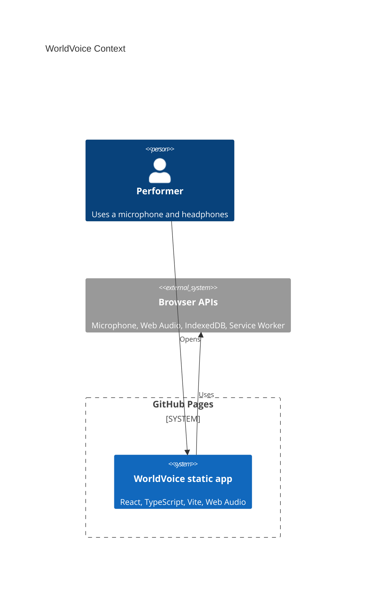

# Architecture

WorldVoice is Mode A: Pure GitHub Pages.

Live URL:

https://baditaflorin.github.io/worldvoice/

Repository:

https://github.com/baditaflorin/worldvoice

## Context



## Container

```mermaid
flowchart TB
  subgraph pages["GitHub Pages static boundary"]
    html["docs/index.html"]
    js["Hashed JS/CSS assets"]
    modelManifest["docs/models/manifest.json"]
    sw["docs/sw.js"]
  end

  subgraph browser["User browser"]
    ui["React control surface"]
    engine["WorldVoiceEngine"]
    pitch["Pitch estimator"]
    graph["Web Audio graph"]
    storage["IndexedDB settings"]
    pwa["Service worker cache"]
  end

  html --> ui
  js --> ui
  modelManifest --> ui
  sw --> pwa
  ui --> engine
  engine --> pitch
  engine --> graph
  ui --> storage
  graph --> headphones["Headphones"]
```

## Module Boundaries

- `src/features/audio/audioEngine.ts` owns microphone access and the Web Audio graph.
- `src/features/audio/pitch.ts` is deterministic and unit-tested.
- `src/features/audio/presets.ts` defines the sound contract.
- `src/features/audio/enhancements.ts` lazy-loads optional heavy modules after a user gesture.
- `src/features/audio/modelManifest.ts` validates static model-pack metadata.
- `src/features/audio/storage.ts` persists settings locally.

## Pages Boundary

GitHub Pages serves only static files from `main` and `/docs`. There is no backend, no runtime API, no Docker image, and no server-side secrets.
